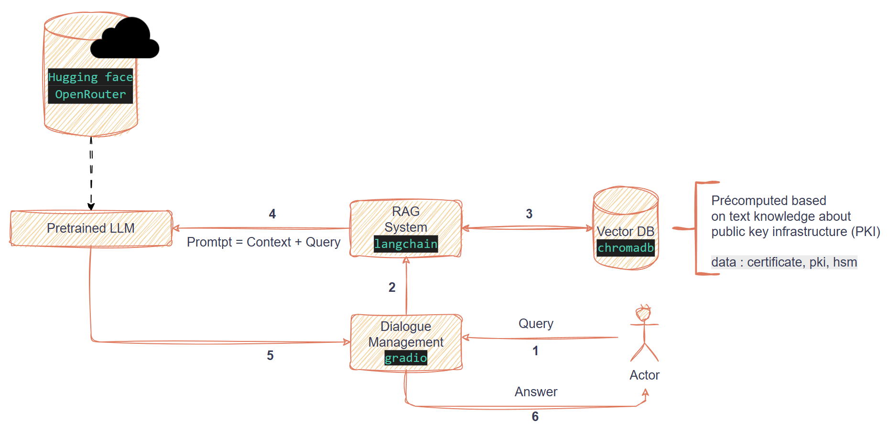

# 🔐 PKI Expert System with RAG

## Goals

Build a Public Key Infrastructure (PKI) expert system using a text-based knowledge base and Retrieval-Augmented Generation (RAG) for context-aware responses.


## Features

* **Retrieval-Augmented Generation (RAG)**
  Combines vector search (via ChromaDB) with text generation (using free models from Hugging Face/openrouter).

* **Automated Knowledge Processing**
  Automatically chunks and indexes documents from the local `knowledge/` folder for efficient retrieval.

* **Interactive Dialog Interface**
  Provides a command-line and Gradio-based assistant that retrieves relevant context and generates informed answers.

* **Modular Architecture**
  Easily extend or replace components such as the LLM, vector database, or prompting logic.


## Project Structure

```text
.
├── Dockerfile                 # Containerization instructions
├── LICENSE                    # Project license
├── README.md                  # Project documentation (this file)
├── db/
│   └── chroma_db              # ChromaDB vector database files
├── docs/
│   └── architecture.png       # System architecture diagram
├── requirements.txt           # Python dependencies
├── src/
    ├── app.py                 # Main application entry point
    ├── embedding_storage.py   # Embedding storage and retrieval logic
    ├── knowledge/             # Folder for source documents (e.g., .txt files)
    ├── llm_pipeline.py        # Language model pipeline and integration
    ├── rag.py                 # RAG (Retrieval-Augmented Generation) core implementation
    └── test.py                # Test scripts and utilities

```

## Architecture




## Prerequesites

- Python 3.10.12+
- openrouter api key
- huggingface api key